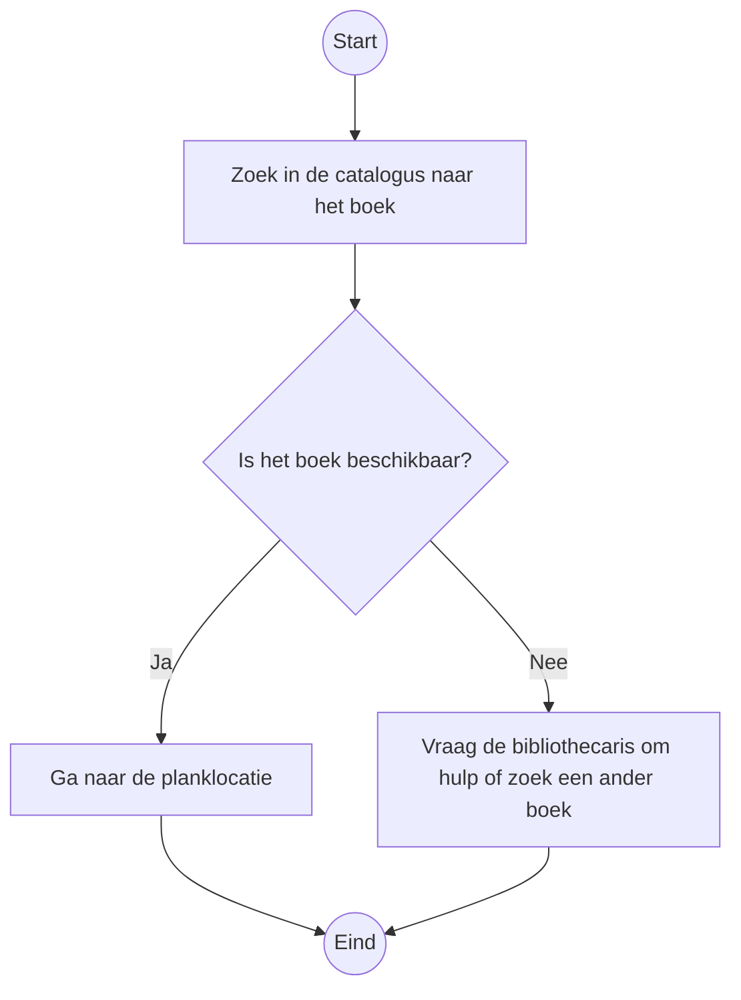

## Hoofdstuk 1: Wat is een algoritme?

### Definitie van een algoritme
Een algoritme is een reeks instructies die worden gevolgd om een probleem op te lossen of een taak uit te voeren. Het is de basis van computerprogrammering en speelt een cruciale rol in softwareontwikkeling. Een algoritme kan eenvoudig zijn, zoals een recept voor het bakken van een taart, of complex, zoals een routeplanner.

### Voorbeelden uit het dagelijks leven
Algoritmes worden dagelijks gebruikt, vaak zonder dat we het beseffen:
- **Navigatie:** Het vinden van de kortste route met Google Maps.
- **Zoeken:** Het zoeken naar een contactpersoon in een telefoonboek.
- **Sorteren:** Het ordenen van e-mails in je inbox op basis van datum of belangrijkheid.

### Waarom zijn algoritmes belangrijk?
Algoritmes stellen ons in staat om efficiëntere en snellere oplossingen te vinden voor complexe problemen. Ze zijn essentieel in de moderne technologie, van zoekmachines tot kunstmatige intelligentie.

### Kenmerken van een goed algoritme
1. **Correctheid:** Het algoritme moet de juiste oplossing bieden.
2. **Efficiëntie:** Het algoritme moet minimale tijd en middelen gebruiken.
3. **Duidelijkheid:** Het algoritme moet eenvoudig te begrijpen en te implementeren zijn.

### Oefeningen
1. Beschrijf een algoritme om een boek in een bibliotheek te vinden.
2. Bedenk een algoritme om een lijst van getallen te sorteren.
3. Maak een flowchart van het algoritme om getallen te sorteren.

>#### 💡 Over flowcharts
> Een flowchart is een diagram dat een proces of een algoritme visueel weergeeft. Het helpt om de logica en stappen van een algoritme beter te begrijpen. Hier zijn de meest gebruikte elementen in een flowchart:
>
> - **Ovalen (Ellipsen):** Deze worden gebruikt om het begin en het einde van een proces aan te geven.
> - **Rechthoeken:** Deze stellen activiteiten of stappen in het proces voor, zoals "Kijk in de catalogus" of "Controleer planklocatie".
> - **Ruiten:** Deze geven beslispunten aan, zoals "Is het boek beschikbaar?". Het proces splitst hier afhankelijk van het antwoord (bijvoorbeeld ja of nee).
> - **Pijlen:** Deze tonen de volgorde waarin de stappen moeten worden uitgevoerd.

> #### Voorbeeld flowchart in Mermaid

Gebruik bovenstaande uitleg en elementen om je eigen flowchart te maken.

---

Laat weten of dit aanpassingen nodig heeft of dat we verder kunnen uitbreiden op hoofdstuk 1!

