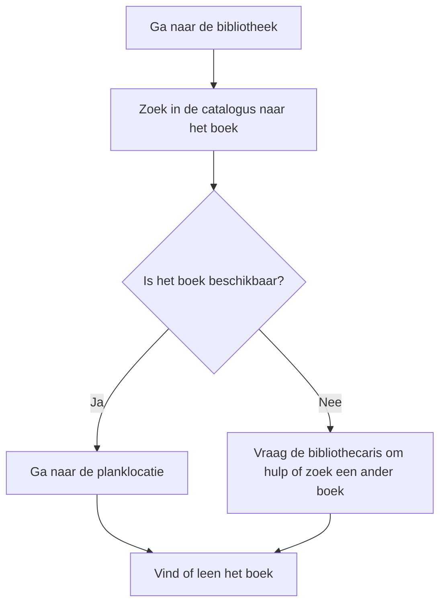

# Syllabus Algoritmes

## Inleiding
Deze syllabus is gebaseerd op het boek *Grokking Algorithms* en biedt een introductie tot fundamentele algoritmische concepten. Het doel is om complexe onderwerpen begrijpelijk en toegankelijk te maken, met behulp van heldere uitleg, visuele ondersteuning en uitgebreide oefeningen. Deze syllabus is bedoeld voor studenten die een basiskennis van programmeren hebben en hun begrip van algoritmes willen verdiepen.

We maken gebruik van de programmeertaal Python, omdat deze eenvoudig te leren is en geschikt is voor het implementeren van algoritmes. Er is minimale voorkennis van wiskunde vereist; het kunnen oplossen van een eerstegraadsvergelijking is voldoende. 

In deze cursus leren we algoritmes te gebruiken om verschillende problemen op te lossen, zoals het vinden van de kortste route, het sorteren van gegevens en het maken van efficiënte zoekmethodes. Daarnaast zullen we ook de prestaties van algoritmes meten, zodat we begrijpen welke oplossingen geschikt zijn voor bepaalde situaties. 

Met deze vaardigheden kun je niet alleen efficiëntere software ontwikkelen, maar ook een dieper inzicht krijgen in hoe complexe systemen werken. Laten we beginnen!

## Hoofdstuk 1: Wat is een algoritme?

### Definitie van een algoritme
Een algoritme is een reeks instructies die worden gevolgd om een probleem op te lossen of een taak uit te voeren. Het is de basis van computerprogrammering en speelt een cruciale rol in softwareontwikkeling. Een algoritme kan eenvoudig zijn, zoals een recept voor het bakken van een taart, of complex, zoals een routeplanner.

### Voorbeelden uit het dagelijks leven
Algoritmes worden dagelijks gebruikt, vaak zonder dat we het beseffen:
- **Navigatie:** Het vinden van de kortste route met Google Maps.
- **Zoeken:** Het zoeken naar een contactpersoon in een telefoonboek.
- **Sorteren:** Het ordenen van e-mails in je inbox op basis van datum of belangrijkheid.

### Waarom zijn algoritmes belangrijk?
Algoritmes stellen ons in staat om efficiëntere en snellere oplossingen te vinden voor complexe problemen. Ze zijn essentieel in de moderne technologie, van zoekmachines tot kunstmatige intelligentie.

### Kenmerken van een goed algoritme
1. **Correctheid:** Het algoritme moet de juiste oplossing bieden.
2. **Efficiëntie:** Het algoritme moet minimale tijd en middelen gebruiken.
3. **Duidelijkheid:** Het algoritme moet eenvoudig te begrijpen en te implementeren zijn.

### Oefeningen
1. Beschrijf een algoritme om een boek in een bibliotheek te vinden.
2. Schrijf in eigen woorden een stappenplan om een taart te bakken.
3. Bedenk een algoritme om een lijst van getallen te sorteren.
4. Maak een flowchart van het algoritme om een boek in een bibliotheek te vinden.

#### Uitleg over flowcharts
Een flowchart is een diagram dat een proces of een algoritme visueel weergeeft. Het helpt om de logica en stappen van een algoritme beter te begrijpen. Hier zijn de meest gebruikte elementen in een flowchart:

- **Ovalen (Ellipsen):** Deze worden gebruikt om het begin en het einde van een proces aan te geven.
- **Rechthoeken:** Deze stellen activiteiten of stappen in het proces voor, zoals "Kijk in de catalogus" of "Controleer planklocatie".
- **Ruiten:** Deze geven beslispunten aan, zoals "Is het boek beschikbaar?". Het proces splitst hier afhankelijk van het antwoord (bijvoorbeeld ja of nee).
- **Pijlen:** Deze tonen de volgorde waarin de stappen moeten worden uitgevoerd.

#### Voorbeeld flowchart

Gebruik bovenstaande uitleg en elementen om je eigen flowchart te maken.
Hier is een eenvoudig voorbeeld van een flowchart voor het zoeken naar een boek in de bibliotheek:

1. **Start**: Ga naar de bibliotheek. *(Ovaal)*
2. **Stap 1**: Zoek in de catalogus naar het boek. *(Rechthoek)*
3. **Beslissing**: Is het boek beschikbaar? *(Ruit)*
   - **Ja**: Ga naar de planklocatie. *(Pijl naar rechthoek)*
   - **Nee**: Vraag de bibliothecaris om hulp of zoek een ander boek. *(Pijl naar andere rechthoek)*
4. **Eind**: Vind of leen het boek. *(Ovaal)*

Gebruik bovenstaande uitleg en elementen om je eigen flowchart te maken., vanaf het binnenkomen in de bibliotheek tot het vinden van het boek of constateren dat het niet beschikbaar is.

---

Laat weten of dit aanpassingen nodig heeft of dat we verder kunnen uitbreiden op hoofdstuk 1!

