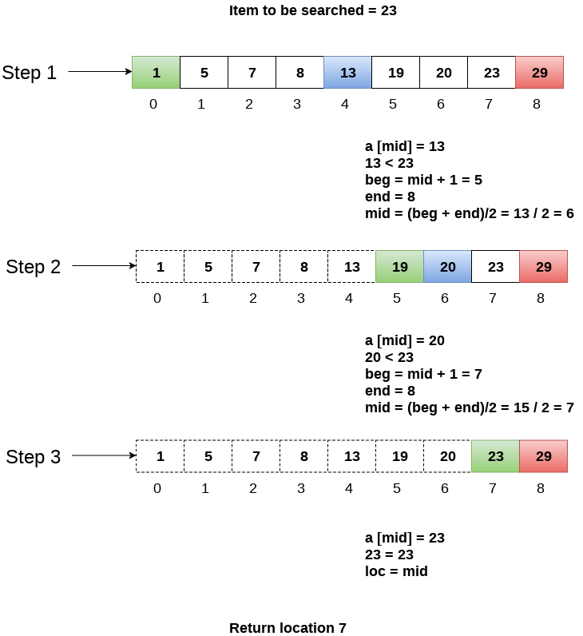
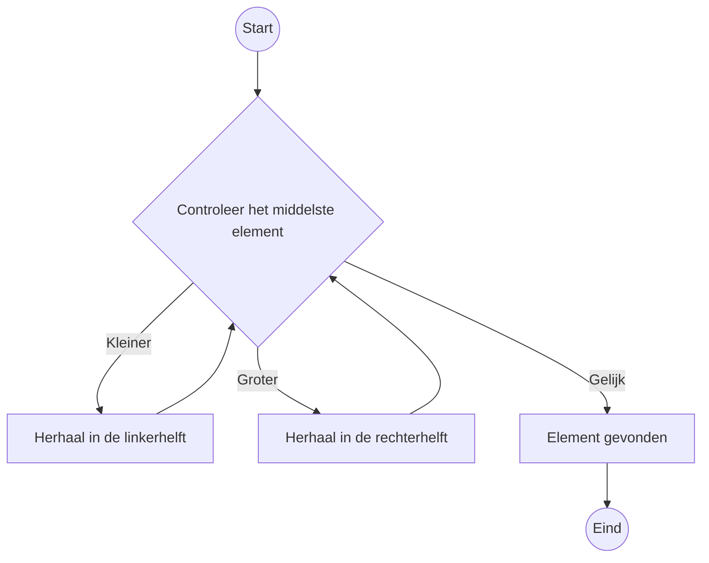

## Hoofdstuk 2: Binaire zoekopdrachten

### Introductie
Binaire zoekopdrachten zijn een efficiënte manier om snel een item in een gesorteerde lijst te vinden. Het werkt door telkens de lijst in tweeën te splitsen en te controleren in welke helft het item zich bevindt. Deze techniek bespaart tijd, vooral bij grote datasets, en is veel sneller dan lineair zoeken.

Stel je voor dat je een persoon zoekt in een telefoonboek. Hun naam begint met de letter K. In plaats van vanaf het begin te zoeken, kun je starten in het midden, omdat je weet dat de K's zich daar ongeveer bevinden. Dit principe wordt toegepast in binaire zoekopdrachten.

Een ander voorbeeld: als je een woord zoekt in een woordenboek dat begint met de letter O, begin je ook ergens in het midden, omdat je weet dat de O's daar in de buurt staan.

Moderne toepassingen zoals Facebook gebruiken binaire zoekopdrachten om gebruikersnamen snel te vinden in hun database. Bijvoorbeeld, als je gebruikersnaam "karlmageddon" is, begint de zoekopdracht in het midden van de database en halveert deze steeds totdat de juiste naam is gevonden.

Binaire zoekopdrachten werken alleen met gesorteerde lijsten. Als een lijst niet gesorteerd is, zal dit algoritme niet correct functioneren.
1. Begin met het midden van de lijst.
2. Vergelijk het doelgetal met het middelste getal.
3. Als het doelgetal kleiner is dan het middelste getal, herhaal de stappen in de linkerhelft van de lijst.
4. Als het doelgetal groter is, herhaal de stappen in de rechterhelft van de lijst.
5. Als het doelgetal gelijk is aan het middelste getal, is het gevonden.
6. Stop als de lijst leeg is (het item is niet aanwezig).



### Voorbeeld in Python
```python
# Voorbeeld van een binaire zoekopdracht

def binaire_zoekopdracht(lijst, doel):
    laag = 0
    hoog = len(lijst) - 1

    while laag <= hoog:
        midden = (laag + hoog) // 2
        gok = lijst[midden]

        if gok == doel:
            return midden
        elif gok > doel:
            hoog = midden - 1
        else:
            laag = midden + 1

    return -1  # Item niet gevonden

# Test de functie
lijst = [1, 3, 5, 7, 9, 11]
doel = 7
resultaat = binaire_zoekopdracht(lijst, doel)
print("Het doel is gevonden op index:", resultaat)
```

### Grafische voorstelling
Een binaire zoekopdracht kan worden weergegeven als een beslissingsboom:



### Oefeningen
1. Stel je hebt een gesorteerde lijst met 128 namen. Hoeveel stappen zijn nodig om een naam te vinden met binaire zoekopdrachten?
2. Wat gebeurt er als je de lijst verdubbelt naar 256 namen? Hoeveel stappen zijn dan nodig?
3. Pas de binaire zoekopdracht toe op de lijst [2, 4, 6, 8, 10, 12, 14] om 10 te vinden. Teken de stappen in een flowchart.
4. Verander de Python-code zodat deze ook de stappen toont die worden doorlopen.
5. Wat gebeurt er als de lijst niet is gesorteerd? Leg uit waarom binaire zoekopdrachten in dat geval niet werken.
6. Schrijf een functie die controleert of een lijst gesorteerd is voordat een binaire zoekopdracht wordt uitgevoerd. op de lijst [2, 4, 6, 8, 10, 12, 14] om 10 te vinden. Teken de stappen in een flowchart.
2. Verander de Python-code zodat deze ook de stappen toont die worden doorlopen.
3. Wat gebeurt er als de lijst niet is gesorteerd? Leg uit waarom binaire zoekopdrachten in dat geval niet werken.
4. Schrijf een functie die controleert of een lijst gesorteerd is voordat een binaire zoekopdracht wordt uitgevoerd.

---

Laat weten of dit aanpassingen nodig heeft of dat we verder kunnen uitbreiden op hoofdstuk 2!

