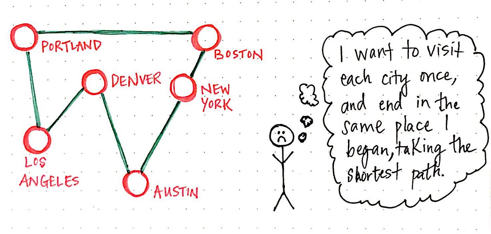

## Hoofdstuk 3: Big O-notatie

### Introductie

Big O-notatie is een manier om de efficiëntie van algoritmes te beschrijven, met name in termen van tijd en ruimtecomplexiteit. Het helpt ons om de prestaties van verschillende algoritmes te vergelijken, vooral als de invoergrootte (n) toeneemt.

### Wat is Big O?

Big O beschrijft hoe de tijd of ruimte die een algoritme gebruikt, verandert afhankelijk van de grootte van de invoer. Het is een maatstaf voor de **slechtste prestatie** (worst-case scenario).

Wanneer we het over algoritmes hebben, bespreken we vaak hun **looptijd**. Over het algemeen wil je het meest efficiënte algoritme kiezen, of je nu optimaliseert voor tijd of ruimte. 

Terug naar binaire zoekopdrachten: hoeveel tijd bespaar je hiermee? Stel dat je elk getal in een lijst één voor één controleert. Voor een lijst met 100 getallen kan dit maximaal 100 keer raden betekenen. Voor een lijst met 4 miljard getallen kan het maximaal 4 miljard keer raden betekenen. Dit noemen we lineaire tijd.

Bij een binaire zoekopdracht is dit anders. Voor een lijst van 100 items kost het maximaal 7 stappen, en voor een lijst van 4 miljard items kost het maximaal 32 stappen. Dit komt omdat binaire zoekopdrachten werken in logaritmische tijd.

Hier is een samenvatting:

- **O(1):** Constant. Het algoritme gebruikt altijd dezelfde hoeveelheid tijd, ongeacht de invoergrootte.
- **O(n):** Lineair. De tijd groeit evenredig met de invoergrootte.
- **O(log n):** Logaritmisch. De tijd groeit langzaam naarmate de invoergrootte toeneemt.
- **O(n²):** Kwadratisch. De tijd groeit snel, wat inefficiënt is voor grote datasets.
  
💡 **Tip: Wat zijn logaritmen?**

Logaritmen zijn het omgekeerde van exponenten. Bijvoorbeeld:
- **log₂(8) = 3** betekent dat 2 tot de macht 3 gelijk is aan 8 (2³ = 8).
- **log₁₀(1000) = 3** betekent dat 10 tot de macht 3 gelijk is aan 1000 (10³ = 1000).
- **log₂(16) = 4** betekent dat 2 tot de macht 4 gelijk is aan 16 (2⁴ = 16).

Logaritmen geven aan hoe vaak je een getal moet verdubbelen (of halveren) om een doelwaarde te bereiken.

💡 **In deze cursus werken we altijd met logaritmen met basis 2 (log₂).** Dit betekent dat we vooral kijken naar hoe vaak een invoergrootte kan worden gehalveerd, wat vooral belangrijk is bij efficiënte algoritmes zoals binaire zoekopdrachten. In Big O-notatie betekent **O(log n)** dat een algoritme heel efficiënt is: elke extra verdubbeling van de invoergrootte verhoogt de looptijd slechts met één extra stap.

Een praktisch voorbeeld: Bob werkt aan een algoritme voor NASA. Hij moet kiezen tussen lineaire zoekopdrachten en binaire zoekopdrachten voor het bepalen van de landingsplek van een raket. Bij 1 miljard elementen duurt lineaire zoekopdracht **11 dagen**, terwijl een binaire zoekopdracht slechts **30 milliseconden** kost. Dit toont aan hoe belangrijk de keuze van het algoritme is.

### Voorbeelden

1. **O(1):**
   ```python
   def constant_example(array):
       return array[0]  # Altijd één bewerking
   ```

2. **O(n):**
   ```python
   def linear_example(array):
       for element in array:
           print(element)  # Eén bewerking per element
   ```

3. **O(log n):**
   - Dit zien we bij binaire zoekopdrachten, waar de lijst telkens wordt gehalveerd.

4. **O(n²):**
   ```python
   def quadratic_example(array):
       for i in array:
           for j in array:
               print(i, j)  # Geneste loops
   ```

### Visualisatie

Hieronder een grafiek van de verschillende groeisnelheden:

- **O(1):** Plat.
- **O(n):** Lineair stijgend.
- **O(log n):** Zeer traag stijgend.
- **O(n²):** Exponentieel stijgend.


Voorbeeld:

1. Stel dat je een rooster met 16 vakjes wilt tekenen:
   - **Algoritme 1 (O(n))**: Teken één vakje per stap. Dit kost 16 stappen.
   - **Algoritme 2 (O(log n))**: Vouw papier vier keer en maak een rooster met 16 vakjes in slechts 4 stappen.

2. Voor een rooster met 1.024 vakjes:
   - **O(n)**: 1.024 stappen nodig.
   - **O(log n)**: Slechts 10 stappen nodig.

### Praktische toepassing

Bij het ontwerpen van efficiënte algoritmes willen we tijd- en ruimtecomplexiteit minimaliseren. Big O-notatie helpt om de impact van onze keuzes te begrijpen, vooral bij grote datasets.

## Extra: Het Traveling Salesperson-probleem

### Introductie
Het **Traveling Salesperson-probleem (TSP)** is een beroemd probleem in de informatica dat bekend staat om zijn extreem slechte tijdcomplexiteit. Het valt onder de categorie **O(n!)** algoritmes, ofwel factorial time. 



### Het probleem
Een verkoper moet een aantal steden bezoeken, waarbij hij:
1. Elke stad precies één keer bezoekt.
2. De totale afstand minimaliseert.

#### Voorbeeld:
- Stel dat de verkoper 5 steden moet bezoeken.
- Mogelijke volgordes om deze steden te bezoeken zijn: 5! = 120 permutaties.
- Voor 6 steden zijn er 6! = 720 permutaties.
- Voor 7 steden zijn er 7! = 5.040 permutaties.

#### Factorial Growth
De tijd die nodig is om het probleem op te lossen groeit exponentieel met het aantal steden. Voor \( n \) steden:
\[
T(n) = n! 
\]

Voor grote waarden van \( n \) wordt het oplossen van dit probleem binnen redelijke tijd praktisch onmogelijk. Bijvoorbeeld:
- Bij 10 steden: 10! = 3.628.800 mogelijke routes.
- Bij 20 steden: 20! ≈ 2.43 × 10¹⁸ mogelijke routes.

### Onopgeloste uitdaging
Er bestaat geen snelle bekende oplossing voor het Traveling Salesperson-probleem. Het wordt beschouwd als een van de moeilijkste problemen in de informatica, en het vinden van een efficiënte oplossing zou grote doorbraken betekenen. Voor nu worden vaak benaderende algoritmes gebruikt om acceptabele oplossingen te vinden binnen een redelijke tijd.

### Belangrijkste punten:
1. Het TSP is een voorbeeld van een probleem met **O(n!)** tijdcomplexiteit.
2. Factorial groei is extreem inefficiënt voor grote invoer.
3. Het oplossen van TSP vereist vaak benaderende of heuristische methodes.


### Oefeningen

1. Analyseer de tijdcomplexiteit van de volgende code:
   ```python
   def example(array):
       for i in range(len(array)):
           for j in range(10):
               print(array[i], j)
   ```

2. Geef de Big O-notatie van:
   - Het itereren over een lijst.
   - Het uitvoeren van een binaire zoekopdracht.

3. Maak een grafiek die de complexiteiten **O(1)**, **O(n)**, en **O(n²)** toont voor n van 1 tot 100.

4. Beantwoord de volgende vragen in termen van Big O:
   - Je hebt een naam en wilt het telefoonnummer van de persoon vinden in een telefoonboek.
   - Je hebt een telefoonnummer en wilt de naam van de persoon vinden. (Hint: Dit vereist een lineaire zoekopdracht.)
   - Je wilt de nummers van alle mensen in het telefoonboek lezen.
   - Je wilt de nummers lezen van alleen de namen die beginnen met de letter "A".

