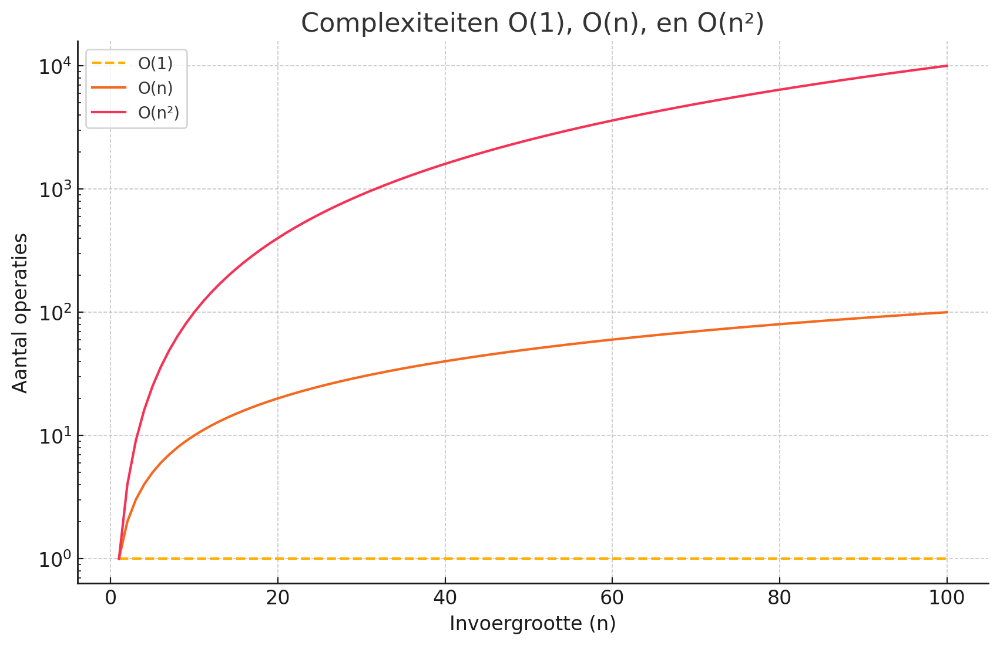

### Oplossingen H3

#### 1. Analyseer de tijdcomplexiteit van de code:

**Code:**
```python
   def example(array):
       for i in range(len(array)):
           for j in range(10):
               print(array[i], j)
```

**Oplossing:**
- De buitenste `for`-loop loopt door elk element in `array` → **O(n)**.
- De binnenste `for`-loop loopt altijd 10 keer → **O(10)** (constant).
- Totale tijdcomplexiteit: **O(n)**.

#### 2. Geef de Big O-notatie van:
- **Het itereren over een lijst:**
   - **O(n)** (lineaire tijdcomplexiteit).

- **Het uitvoeren van een binaire zoekopdracht:**
   - **O(log n)** (logaritmische tijd).

#### 3. Maak een grafiek:

De complexiteiten **O(1)**, **O(n)**, en **O(n²)** werden visueel weergegeven in de grafiek. Dit toont duidelijk hoe exponentiële groei zich onderscheidt van lineaire en constante complexiteit.

#### 4. Beantwoord de volgende vragen in termen van Big O:

1. **Je hebt een naam en wilt het telefoonnummer van de persoon vinden in een telefoonboek:**
   - **O(log n)** (binaire zoekopdracht).

2. **Je hebt een telefoonnummer en wilt de naam van de persoon vinden:**
   - **O(n)** (lineaire zoekopdracht).

3. **Je wilt de nummers van alle mensen in het telefoonboek lezen:**
   - **O(n)** (alle items doorlopen).

4. **Je wilt de nummers lezen van alleen de namen die beginnen met de letter "A":**
   - **Als gesorteerd:** **O(k)** (waarbij k het aantal namen met "A" is).
   - **Als niet gesorteerd:** **O(n)** (lineair zoeken).

