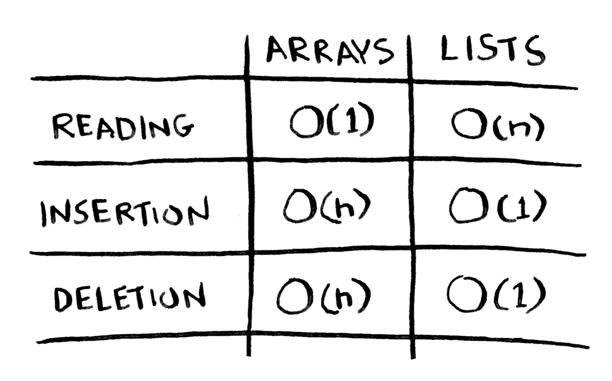
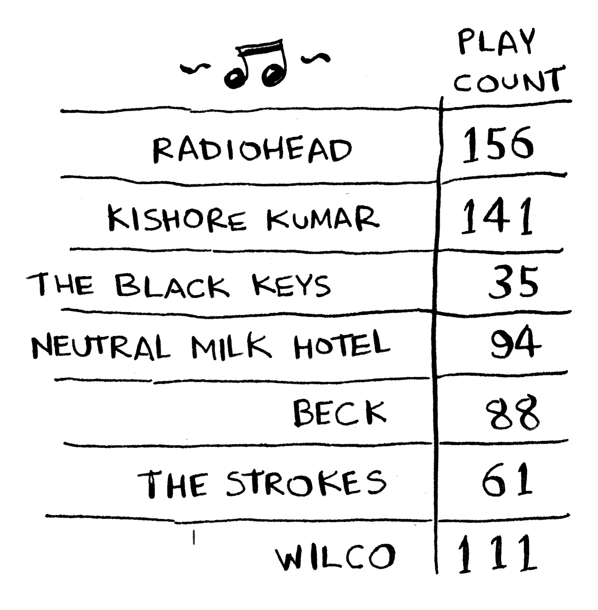

# Syllabus Algoritmes: Hoofdstuk 4

## Inleiding
In dit hoofdstuk leer je over **arrays** en **gekoppelde lijsten**—twee van de meest fundamentele datastructuren. Deze worden overal gebruikt. Je hebt arrays al gebruikt in hoofdstuk 1, en je zult ze in bijna elk hoofdstuk van deze syllabus tegenkomen. Arrays zijn een cruciaal onderwerp, dus let goed op! Maar soms is het beter om een gekoppelde lijst te gebruiken in plaats van een array. In dit hoofdstuk bespreken we de voor- en nadelen van beide, zodat je kunt beslissen welke het beste bij je algoritme past.

Daarnaast maak je kennis met **Selection Sort**, je eerste sorteeralgoritme. Veel algoritmes werken alleen als je gegevens gesorteerd zijn. Denk bijvoorbeeld aan binaire zoekopdrachten: deze kun je alleen uitvoeren op een gesorteerde lijst. Hoewel de meeste programmeertalen ingebouwde sorteeralgoritmes hebben, is het belangrijk om de basis te begrijpen. Selection Sort is een opstap naar meer geavanceerde algoritmes zoals Quicksort, die in het volgende hoofdstuk aan bod komt.

Om de prestatieanalyse van dit algoritme goed te begrijpen, moet je bekend zijn met **Big O-notatie** en **logaritmen**. Als je deze concepten nog niet begrijpt, raad ik aan om terug te gaan naar hoofdstuk 3.

---

### Hoe werkt geheugen?
Stel je computergeheugen voor als een grote ladekast, waarbij elke lade een adres heeft. 


Bijvoorbeeld, het adres `0xffeeb` is een locatie in het geheugen. 
Elke keer dat je een item in het geheugen wilt opslaan, vraag je de computer om ruimte. De computer geeft je een adres waar je je item kunt opslaan.

Wanneer je meerdere items wilt opslaan, zijn er twee basismethoden: **arrays** en **gekoppelde lijsten**. Elk van deze structuren heeft zijn eigen voor- en nadelen. Er is geen "juiste" manier om items op te slaan; de keuze hangt af van je gebruiksscenario.

### Arrays en gekoppelde lijsten
Soms moet je een lijst met elementen in het geheugen opslaan. Stel dat je een app schrijft om je taken bij te houden. Je wilt de taken als een lijst in het geheugen opslaan.

Gebruik je een array of een gekoppelde lijst? Laten we de taken eerst in een array opslaan, omdat dit makkelijker te begrijpen is. Als je een array gebruikt, worden al je taken opeenvolgend (direct naast elkaar) in het geheugen opgeslagen.

#### Arrays
Stel dat je een vierde taak wilt toevoegen, maar de volgende geheugenlocatie is al in gebruik door iets anders!

Het is alsof je naar een film gaat met je vrienden en een plek probeert te vinden om te zitten—maar een andere vriend komt erbij, en er is geen plaats meer. Je moet naar een nieuwe plek verhuizen waar jullie allemaal passen. In dit geval moet je de computer om een ander stuk geheugen vragen dat groot genoeg is voor vier taken. Daarna moet je al je taken daar naartoe verplaatsen.

Als er nog een vriend komt, heb je weer geen ruimte—en moet je alles opnieuw verplaatsen! Dit kan behoorlijk vervelend zijn. Net als in het voorbeeld van de film, kan het toevoegen van nieuwe items aan een array een tijdrovend proces zijn. Als je geen ruimte meer hebt, moet je steeds naar een nieuwe plek in het geheugen verhuizen, waardoor het toevoegen van een nieuw item erg traag wordt.

#### Oplossing voor arrays
Een eenvoudige oplossing is om "plaatsen te reserveren": zelfs als je maar 3 items in je takenlijst hebt, kun je de computer vragen om 10 geheugenplaatsen, voor het geval dat. Dan kun je 10 items toevoegen zonder iets te hoeven verplaatsen. Dit is een goede oplossing, maar er zijn enkele nadelen:

- **Ongebruikte ruimte:** Je hebt misschien niet alle extra plaatsen nodig die je hebt gevraagd, en dat geheugen wordt dan verspild. Je gebruikt het niet, maar niemand anders kan het ook gebruiken.
- **Limieten:** Je kunt meer dan 10 items aan je takenlijst toevoegen en moet dan alsnog verhuizen.

Hoewel het een goed compromis is, is het geen perfecte oplossing. **Gekoppelde lijsten** bieden een betere aanpak voor het toevoegen van items.

#### Gekoppelde lijsten (linked lists)
Bij gekoppelde lijsten kunnen je items overal in het geheugen staan. Elk item slaat het adres van het volgende item in de lijst op. Een reeks willekeurige geheugenadressen wordt dus met elkaar verbonden.

Het is alsof je een schattenjacht doet. Je gaat naar het eerste adres, en het zegt: "Het volgende item vind je op adres 123." Dan ga je naar adres 123, en het zegt: "Het volgende item vind je op adres 847," enzovoort. Het toevoegen van een item aan een gekoppelde lijst is eenvoudig: je plaatst het ergens in het geheugen en slaat het adres op bij het vorige item.

Met gekoppelde lijsten hoef je je items nooit te verplaatsen. Je voorkomt ook een ander probleem: stel dat je een bioscoop bezoekt met vijf vrienden en probeert een plek te vinden om samen te zitten, maar de zaal is vol. Er zijn geen zes stoelen naast elkaar beschikbaar. Dit gebeurt soms ook met arrays. Als je bijvoorbeeld 10.000 geheugenplaatsen nodig hebt voor een array, maar die ruimte niet aaneengesloten beschikbaar is, kun je geen ruimte voor je array krijgen! Een gekoppelde lijst is alsof je zegt: "Laten we opsplitsen en toch de film kijken." Als er ruimte is in het geheugen, is er ruimte voor je gekoppelde lijst.

**Waarom zou je arrays dan gebruiken?** Arrays zijn erg efficiënt als je snel willekeurige elementen wilt lezen. Stel dat je de vijfde taak in je lijst wilt lezen. Bij een array kun je deze direct ophalen, omdat de elementen aaneengesloten in het geheugen staan. Bij een gekoppelde lijst moet je echter beginnen bij het eerste item, het adres volgen naar het tweede item, dan naar het derde, enzovoort, totdat je bij het vijfde item bent. Daarom zijn arrays beter voor snel lezen en willekeurige toegang.

---

### Invoegen en verwijderen in lijsten

#### Elementen invoegen in het midden van een lijst
Stel dat je je takenlijst meer als een kalender wilt gebruiken. Voorheen voegde je taken toe aan het einde van de lijst. Nu wil je ze toevoegen op volgorde van prioriteit.

- Bij **gekoppelde lijsten** is dit eenvoudig: verander simpelweg de verwijzing van het vorige element naar het nieuwe element.
- Bij **arrays** is het lastiger: je moet alle elementen na de invoegpositie verschuiven. Als er geen ruimte meer is, moet je mogelijk de hele array naar een nieuwe locatie kopiëren.

#### Elementen verwijderen uit een lijst
Als je een element wilt verwijderen:
- **Gekoppelde lijsten:** Verander de verwijzing van het vorige element, en je bent klaar.
- **Arrays:** Je moet alle resterende elementen naar boven schuiven om de lege plek op te vullen.
- 


In tegenstelling tot het toevoegen van elementen, werkt verwijderen altijd, omdat er geen extra ruimte nodig is. Het is wel belangrijk op te merken dat zowel invoegen als verwijderen alleen O(1)-tijd kost als je direct toegang hebt tot het betreffende element. Daarom is het handig om bij gekoppelde lijsten de eerste en laatste elementen bij te houden.

#### Toepassingen van arrays en gekoppelde lijsten
Welke datastructuur je gebruikt, hangt af van het gebruiksscenario:
- **Arrays:** Geschikt als je snel toegang nodig hebt tot willekeurige elementen, omdat ze directe toegang bieden (random access).
- **Gekoppelde lijsten:** Ideaal voor scenario's waarin veel invoeg- en verwijderoperaties nodig zijn.

Er zijn twee soorten toegang:
1. **Sequentiële toegang:** Elementen worden één voor één gelezen, beginnend bij het eerste element. Gekoppelde lijsten zijn hier goed in.
2. **Willekeurige toegang:** Je kunt direct naar een specifiek element springen. Arrays zijn hier beter geschikt.

Arrays en gekoppelde lijsten vormen de basis van veel andere datastructuren die later in deze syllabus worden besproken.

## Wat is Selection Sort?

Selection Sort is een eenvoudig sorteeralgoritme waarmee je een lijst kunt ordenen door telkens het kleinste element te vinden en dit op de juiste positie te plaatsen. Laten we dit algoritme stap voor stap bekijken:

1. **Vind het kleinste element** in de lijst.
2. **Wissel** dit element met het eerste element in de lijst.
3. Herhaal dit proces voor het resterende ongesorteerde gedeelte van de lijst.

Bijvoorbeeld:
- Input: `[5, 2, 9, 1, 5, 6]`
- Output: `[1, 2, 5, 5, 6, 9]` (oplopend gesorteerd)

**Gebruiksscenario:**
Stel dat je een muziekcollectie hebt met voor elke artiest het aantal keer dat je een nummer hebt afgespeeld. Je wilt deze lijst sorteren van meest naar minst afgespeeld. Met Selection Sort kun je dit doen door telkens de artiest met het hoogste afspeelcijfer te selecteren en bovenaan de lijst te plaatsen.



Je zou door de volledige lijst kunnen lopen en de meest gespeelde artist aan een nieuwe lijst toevoegen.


Na de volgende iteratie krijg je dit.


Uiteindelijk eindig je met een gesorteerde lijst.


**Complexiteit:**


Dit algoritme vraagt **O(n *x* n)** tijd of **O(n²)**
- Beste, gemiddelde en slechtste geval: **O(n²)**
  - Je doorloopt voor elk element de resterende lijst om het kleinste element te vinden.

>💡Waarom blijft de complexiteit O(n²)?

> Misschien vraag je je af: terwijl je door de lijst gaat, neemt het aantal elementen dat je moet controleren af. Uiteindelijk controleer je slechts één element. Hoe kan de runtime dan nog steeds O(n²) zijn? Dat heeft te maken met hoe Big O-notatie werkt. Hier is het belangrijkste idee:

> Je hoeft inderdaad niet elke keer een lijst van n elementen te doorlopen. In plaats daarvan controleer je n elementen, dan n - 1, dan n - 2, enzovoort, tot je bij 1 element komt.

> Gemiddeld controleer je een lijst met n/2 elementen per iteratie.

> De totale runtime is dus O(n × n/2). Omdat constanten worden genegeerd in Big O-notatie, blijft dit O(n²).

>Hoewel dit logisch lijkt, benadrukt het waarom Selection Sort niet efficiënt is voor grote datasets. Gelukkig leer je in volgende hoofdstukken efficiëntere algoritmen zoals Quicksort.

**Ruimtecomplexiteit:**
- **O(1):** Er is geen extra geheugen nodig, omdat het sorteren in-place gebeurt.

#### Python-implementatie
Hier is een eenvoudige implementatie van Selection Sort in Python:

```python
def findSmallest(arr):
    smallest = arr[0] 
    smallest_index = 0 
    for i in range(1, len(arr)):
        if arr[i] < smallest:
            smallest = arr[i]
            smallest_index = i
    return smallest_index

# Selection Sort implementatie
def selectionSort(arr): 
    newArr = []
    for i in range(len(arr)):
        smallest = findSmallest(arr)
        newArr.append(arr.pop(smallest))
    return newArr

# Voorbeeldgebruik
lijst = [5, 3, 6, 2, 10]
print(selectionSort(lijst))  # Output: [2, 3, 5, 6, 10]
```

Deze code selecteert iteratief het kleinste element en voegt dit toe aan een nieuwe lijst. Uiteindelijk krijg je een gesorteerde lijst.

#### Veelvoorkomende toepassingen
Selection Sort kan worden gebruikt om te sorteren:
- Namen in een telefoonboek
- Reisdagen
- E-mails (van nieuw naar oud)

Hoewel Selection Sort eenvoudig te begrijpen is, is het niet erg efficiënt voor grotere datasets. In latere hoofdstukken zullen we efficiëntere algoritmen zoals **Quicksort** en **Merge Sort** bespreken.

---
1. **Vind het kleinste element** in de lijst.
2. **Wissel** dit element met het eerste element in de lijst.
3. Herhaal dit proces voor het resterende ongesorteerde gedeelte van de lijst.

**Tijdcomplexiteit:**
- Beste, gemiddelde en slechtste geval: **O(n²)**
  - Dit komt doordat je voor elk element de resterende lijst moet doorlopen.

**Ruimtecomplexiteit:**
- **O(1):** Er is geen extra ruimte nodig, omdat het sorteren in-place gebeurt.

---

### Python-implementatie
Hier is een eenvoudige implementatie van Selection Sort:

```python
def selection_sort(arr):
    for i in range(len(arr)):
        # Vind het kleinste element in het ongesorteerde deel
        min_index = i
        for j in range(i + 1, len(arr)):
            if arr[j] < arr[min_index]:
                min_index = j
        # Wissel het kleinste element met het eerste element
        arr[i], arr[min_index] = arr[min_index], arr[i]
    return arr

# Test de functie
lijst = [5, 2, 9, 1, 5, 6]
print(selection_sort(lijst))
```

---

## Oefeningen

1. **Analyseer het algoritme:**
   - Sorteer de lijst `[10, 3, 7, 2, 9]` met Selection Sort en noteer elke stap. Hoeveel vergelijkingen zijn er in totaal gedaan?

2. **Vergelijk met andere lijsten:**
   - Test het algoritme op de volgende lijsten:
     - `[1, 2, 3, 4, 5]` (al gesorteerd)
     - `[5, 4, 3, 2, 1]` (omgekeerd gesorteerd)
   - Wat valt je op over het aantal stappen?

3. **Pas Selection Sort aan:**
   - Implementeer een versie van Selection Sort die een lijst in aflopende volgorde sorteert.

4. **Theoretische vraag:**
   - Waarom is Selection Sort minder efficiënt dan bijvoorbeeld Quicksort of Merge Sort?

5. **Datastructuur keuzes:**
   - **2.2:** Stel je bouwt een app voor restaurants om bestellingen bij te houden. Servers voegen bestellingen toe aan de achterkant van de wachtrij en koks halen bestellingen van de voorkant van de wachtrij. Zou je een array of een gekoppelde lijst gebruiken? *(Hint: Gekoppelde lijsten zijn goed voor invoegen/verwijderen, arrays zijn goed voor willekeurige toegang.)*
   - **2.3:** Stel je voor dat Facebook een lijst van gebruikersnamen bijhoudt. Als iemand probeert in te loggen, wordt een binaire zoekopdracht uitgevoerd om hun naam te vinden. Gezien dat binaire zoekopdrachten willekeurige toegang vereisen, zou je deze lijst implementeren als een array of een gekoppelde lijst?
   - **2.4:** Stel dat je een array gebruikt om de gebruikersnamen te bewaren. Wat zijn de nadelen van een array bij het invoegen van nieuwe gebruikers?
   - **2.5:** Stel je hebt een hybride datastructuur: een array van gekoppelde lijsten. Elke index in de array vertegenwoordigt een letter van het alfabet en verwijst naar een gekoppelde lijst met alle gebruikersnamen die met die letter beginnen. Vergelijk deze structuur met arrays en gekoppelde lijsten. Is het sneller of langzamer voor zoeken en invoegen?

---

Met deze kennis over Selection Sort en datastructuren ben je klaar om meer geavanceerde sorteeralgoritmes te begrijpen, zoals Quicksort, die in het volgende hoofdstuk aan bod komt.

